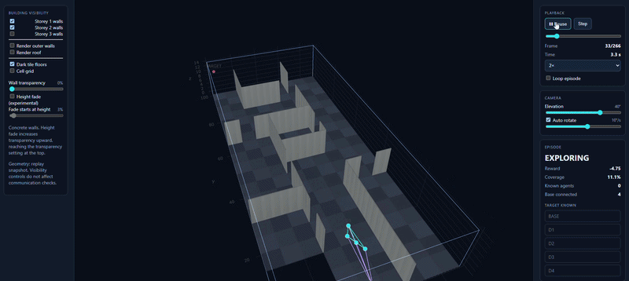

# SwarmEcho

SwarmEcho is a **JAX-accelerated multi-agent reinforcement learning** project that trains a drone swarm to explore an environment and form a communication relay between a base and a discovered target. The current runtime supports **3D buildings and cuboid worlds**, using recurrent MAPPO (Multi-Agent PPO with a centralised critic) and optional TarMAC communication.

The demos show the project's progression from 2D to 3D. The 2D implementation is available on the [`2d_core_features_only` branch](https://github.com/M4GI3R/SwarmEcho/tree/2d_core_features_only).

<p align="center"><strong>Earlier 2D demo</strong></p>
<p align="center">
  
</p>

<p align="center"><strong>Current 3D demo</strong></p>
<p align="center">
  
</p>

---

## Architecture

The `src/swarmecho/` package separates configuration, the environment, models, training, analysis, visualization, and map authoring:

```text
SwarmEcho/
├── docs/                      Technical reference, guides, and project history
├── src/swarmecho/
│   ├── core/                  Level loading, configuration, and utilities
│   ├── curriculum_config/     3D levels, maps, and building editor
│   ├── env/                   Environment, building geometry, observations, and rewards
│   ├── models/                MAPPO actor, critic, and recurrent communication
│   ├── training/              Rollouts, PPO, checkpoints, and evaluation
│   ├── analysis/              Cross-run analysis dashboard
│   └── visualize/             Replay data and interactive spatial inspector
└── README.md
```

---

## Installation

**Prerequisites:** the project's WSL2/CUDA environment and the `uv` package manager. Run Python and training commands from the repository root in WSL.

```bash
git clone https://github.com/M4GI3R/SwarmEcho.git
cd SwarmEcho
uv sync
```

If this checkout was already installed before the CLI names were unified, run `uv sync` again to refresh its entry points.

---

## Quick Start

### 1. Train the 3D baseline

```bash
uv run swarmecho-train level=M00_no_maze_open_cuboid
```

Level files select the environment and training settings. Override individual values with `key=value`, for example `training.num_envs=512 logging.wandb_mode=online`.

### 2. Start curriculum training

Run levels in order; each stage inherits the previous stage's final checkpoint:

```bash
uv run swarmecho-curriculum levels=M00_no_maze_open_cuboid,M01_no_maze_open_cuboid_tall logging.run_name=curriculum
```

### 3. Train a single level

For example, train the office finding task:

```bash
uv run swarmecho-train level=B01a_office_find_only logging.run_name=office
```

### 4. Run multiple seeds

Run sequential training jobs with distinct seeds:

```bash
uv run swarmecho-multi-train level=M00_no_maze_open_cuboid seeds=3 base_seed=42 logging.run_name=baseline
```

### 5. Edit a 3D building

Launch the browser-based building editor, then validate a saved map:

```bash
uv run swarmecho-maze-builder --port 8766
uv run swarmecho-validate-building src/swarmecho/curriculum_config/maps/custom_building.yaml
```

The `maze-builder` command retains its historical name, but opens the 3D building editor.

### 6. Evaluate and inspect a checkpoint

Replace `RUN` and the checkpoint name with an existing run and checkpoint:

```bash
uv run swarmecho-evaluate checkpoint=outputs/RUN/checkpoints/ckpt_000050 mode=parallel replay_after=true replays=3
uv run swarmecho-inspect root=outputs
```

The inspector shows replays and evaluation heatmaps. It opens on port 8765 by default.

### 7. Explore training runs

```bash
uv run swarmecho-dashboard
```

The general dashboard provides cross-run analysis. `swarmecho-eval-dashboard` and `swarmecho-artefacts` are aliases for the spatial inspector.

---

## Documentation Directory

The [documentation index](docs/README.md) links the detailed material:

- [Reference](docs/01_reference/): architecture, environment, training, and assumptions.
- [Guides](docs/02_guide/): configuration, supported commands, and analysis tools.
- [Roadmap](docs/03_roadmap/): plans and transition history.
- [Archive](docs/04_archive/): earlier experiments and design context.

---

## Output Structure

By default, each training run writes to its own directory:

```text
outputs/
└── {run_name}/
    ├── checkpoints/
    │   └── ckpt_000050/       Saved model checkpoint
    └── artifacts/
        ├── train/             Training evaluation data and replays
        └── eval/               Checkpoint evaluation data and replays
```

Curriculum stages also appear as individual run directories under `outputs/`, with names prefixed by `curr_`. A timestamp is appended to a configured run name only when `logging.use_timestamp_postfix=true`.

---

## Core Workflow Validation

Run the small rollout and PPO update validator in the project's WSL environment:

```bash
uv run swarmecho-validate
```

For the full command list, including evaluation options and benchmarking, see the [commands guide](docs/02_guide/03_commands.md).
