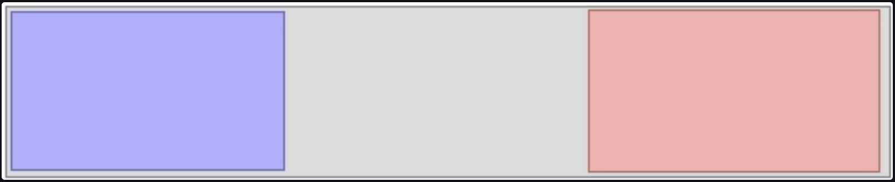
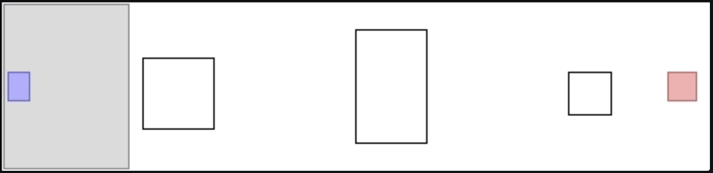
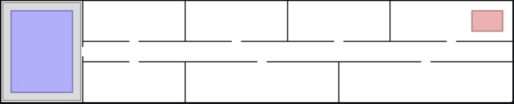
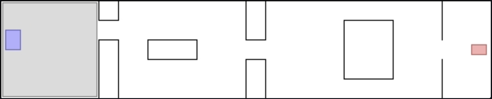
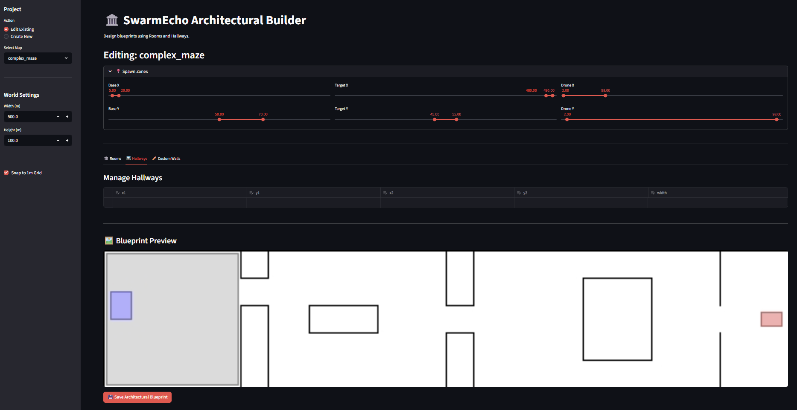

# Configuration & Curriculum Guide

SwarmEcho uses a modular, layered YAML configuration ecosystem. This is the single source of truth for all parameters, geometry, and neural sizes.

## 1. Parameters & Where to Find Them
Rather than hardcoding arrays, all global settings live in `src/curriculum_config/base_params.yaml`. The file is separated into semantic domains:

| Domain | Description / Usage |
|---|---|
| `env` | World physics, drone radius, vision limits, total agent count, and map name. |
| `reward` | Scaling coefficients for exploration, chain gaps, and success bonuses. |
| `training` | Central RL config (learning rates, PPO clipping ratios, entropy coefficient scaling, GAE parameters `gamma`/`lambda`). |
| `network` | Hidden layer dimensions, number of layers, activation types. |
| `logging` | Interval lengths for weights & biases syncs and evaluative video renders. |

## 2. Curriculum Overrides
The training system scales difficulty sequentially via the `levels/` directory.
- `base_params.yaml` acts as the overarching default.
- Files like `src/curriculum_config/levels/00.yaml` act as "patches". When a run scales to a new level, the configuration parameters from the level YAML overwrite the base definitions.
- Example: Turning off the target task in early levels to foster raw spatial awareness before enforcing the tether-task.

## 3. Map Geometry (`src/curriculum_config/maps/`)
Maps are fundamentally defined via YAML layouts (rooms, hallways, walls) which are then rasterized into boolean occupancy grids for simulation.
- **The Map Builder:** A Streamlit-based UI to visually place geometric elements. (`src/curriculum_config/maps/scripts/map_builder.py`)
- **Validation Tools:** We bake and prep the maps using scripts inside `src/curriculum_config/maps/scripts/` to ensure full compatibility with JAX raycasting logic.

### Map Gallery Preview
The curriculum dynamically scales by transitioning through these predefined layouts:

|||||
|:---:|:---:|:---:|:---:|
| **Level 00: Open Field** | **Level 01: Warehouse** | **Level 0X: Office Complex** | **Level 02: Complex Maze** |

#### Map Builder Customization
*(Via `map_builder.py`)*

